# Ongrid AI 功能需求文档 v0.9.0

> 本文档详细分解 Ongrid 平台所有 AI 相关功能的架构、流程与交互关系，包含 Mermaid 流程图。

---

## 目录

1. [系统概述](#1-系统概述)
2. [多智能体架构](#2-多智能体架构)
3. [协调员调度系统](#3-协调员调度系统)
4. [工具生态系统](#4-工具生态系统)
5. [对话式告警配置](#5-对话式告警配置)
6. [事件自动调查](#6-事件自动调查)
7. [知识库与 RAG](#7-知识库与-rag)
8. [技能系统](#8-技能系统)
9. [LLM 基础设施](#9-llm-基础设施)
10. [边缘智能体](#10-边缘智能体)
11. [前端交互](#11-前端交互)
12. [可观测性与审计](#12-可观测性与审计)

---

## 1. 系统概述

Ongrid 是一个智能运维平台，其 AI 子系统采用**多智能体协作架构**：一个"首席协调员"(Coordinator) 接收用户请求，通过 `AgentTool` 将诊断任务分派给 6 个领域专家 (Specialist)，并行或串行执行后汇总结论。

### 1.1 整体架构

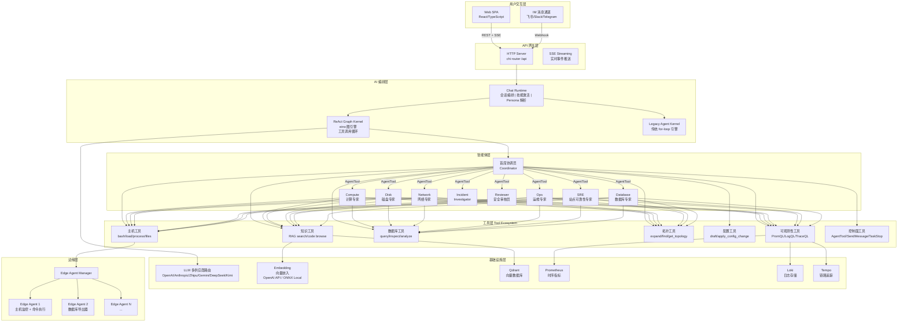

### 1.2 核心数据流

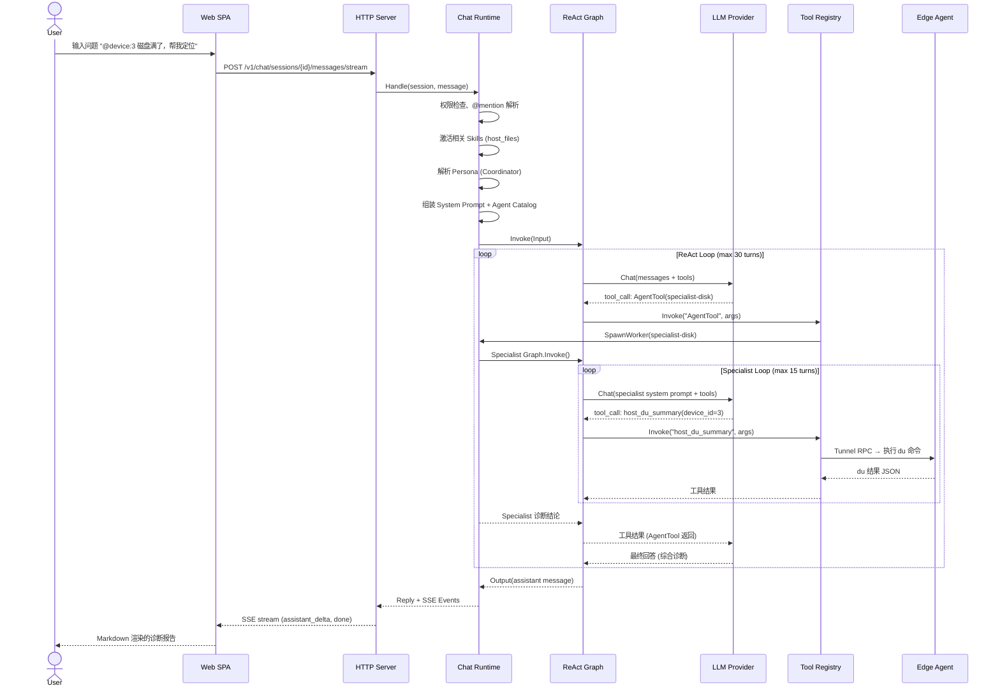

---

## 2. 多智能体架构

### 2.1 智能体清单

Ongrid 共有 **9 个智能体**，每个在 `agents/` 目录下有对应的 Persona 定义文件（YAML Frontmatter + Markdown）。

| 智能体 | Persona ID | 角色 | 权限 | 最大轮次 | 关键工具数 |
|--------|-----------|------|------|---------|-----------|
| **首席协调员** | `default` | 接收用户请求，分派专家 | 精选工具白名单 | 10 | 17 |
| **计算专家** | `specialist-compute` | CPU/内存/负载/OOM/进程 | 只读 | 15 | 8 |
| **磁盘专家** | `specialist-disk` | 磁盘/容量/大文件/文件系统 | 只读 | 15 | 7 |
| **网络专家** | `specialist-network` | OVS/iptables/netns/DNS/路由 | 只读 | 15 | 8 |
| **运维专家** | `specialist-ops` | 服务状态/重启/journalctl/部署 | 只读+受控写入 | 15 | 9 |
| **SRE 专家** | `specialist-sre` | 集群健康度/趋势/SLO/黄金信号 | 只读 | 15 | 10 |
| **数据库专家** | `specialist-database` | SQL/慢查询/连接/死锁/复制 | 只读 | 20 | 8 |
| **事件调查员** | `incident-investigator` | 告警触发后的自动化根因分析 | 只读 | 40 | 15 |
| **安全审核员** | `reviewer` | 破坏性操作的双人确认(SOP) | 只读 | 5 | 3 |

### 2.2 智能体能力矩阵

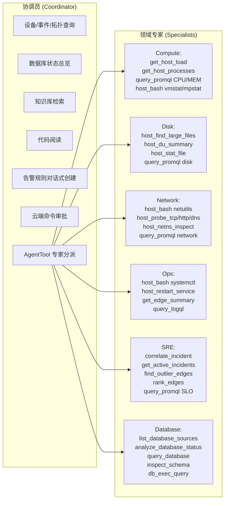

### 2.3 AgentTool 分派机制

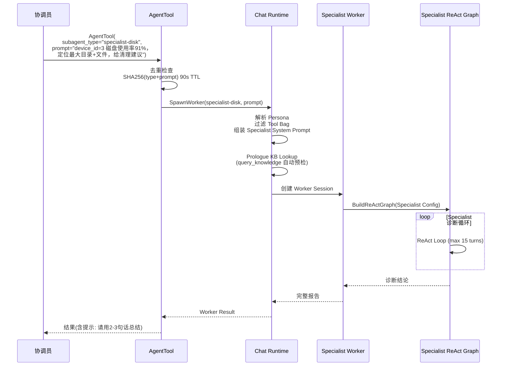

**关键约束：**
- 子智能体**不能嵌套**（Worker 不能再 spawn Worker）
- 去重窗口 90 秒，防止协调员循环重试同一问题
- 同步模式下阻塞等待；异步模式 (background=true) 立即返回，协调员可并发派发多个专家

---

## 3. 协调员调度系统

### 3.1 工具白名单

协调员的工具集被**严格裁剪**，只保留 17 个工具，所有诊断数据查询必须通过 AgentTool 分派给专家：

| 分类 | 工具 | 用途 |
|------|------|------|
| 设备/事件 | `query_devices`, `query_incidents` | 设备查询、事件浏览 |
| 拓扑 | `get_topology` | 部署架构总览 |
| 数据库可观测 | `list_database_sources`, `analyze_database_status` | 数据库源列表、健康分析 |
| 指标目录 | `list_metric_catalog` | 发现可用的 Prometheus 指标 |
| 知识/RAG | `query_knowledge` | 向量知识库搜索 |
| 代码阅读 | `list_repo_sources`, `read_source`, `grep_source` | Git 仓库代码浏览 |
| Web 搜索 | `search_web` | 联网搜索(可选) |
| 云端执行 | `cloud_bash`, `install_skill` | 需人工审批的命令执行 |
| 配置变更 | `draft_config_change`, `apply_config_change` | 对话式告警规则创建 |
| 输出原语 | `serve_page`, `send_im_message` | 发布页面、发送IM消息 |

### 3.2 调度决策流程

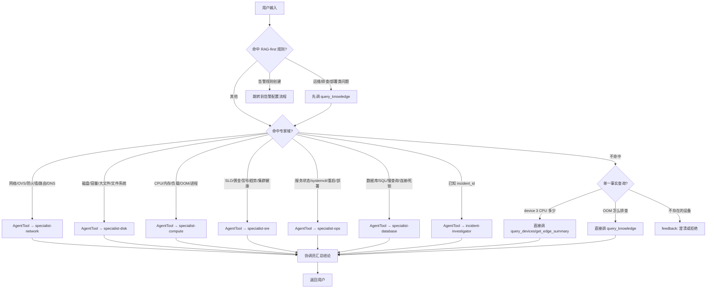

### 3.3 反模式防护

协调员的 System Prompt 中硬编码了以下防护规则：

| 规则 | 检测机制 | 后果 |
|------|---------|------|
| 承诺不执行 | 检测 "让我..." 无 tool_call | 下一轮注入 `<system-reminder>` 警告 |
| 同工具同参数重复 | `tool_adapter.go` 去重缓存 | 返回缓存结果 |
| 单工具超过 8 次调用 | `maxToolCallsPerRun` 计数 | 返回 `call_budget_exceeded` |
| 空 content 的 tool_call | 回调检测 | 记录审计日志 |
| 协调员自行诊断 | 工具白名单限制 | 无对应工具，只能分派 |
| 纯文本告警草案 | `AlertDraftGuardHandler` | 拦截并替换为引导消息 |
| 不调 list_metric_catalog 就 draft | `draftMetricCatalogPreflight` | 拒绝 draft_config_change 调用 |

---

## 4. 工具生态系统

### 4.1 工具注册架构

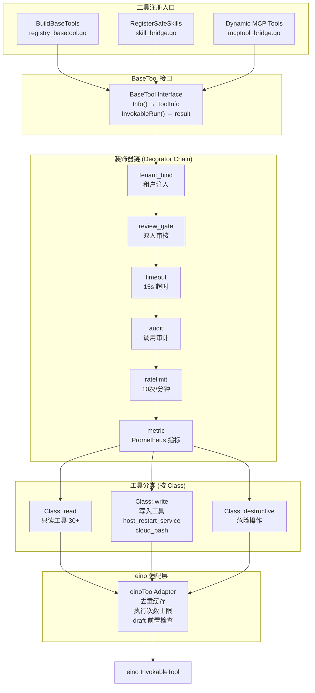

### 4.2 工具清单

#### 可观测性工具

| 工具 | 数据源 | 参数 | 用途 |
|------|--------|------|------|
| `query_promql` | Prometheus | query, start, end, step | PromQL 时序查询 |
| `query_logql` | Loki | query, start, end, limit | LogQL 日志查询 |
| `query_traceql` | Tempo | query, start, end, limit | TraceQL 链路查询 |
| `query_devices` | Manager DB | search, status, labels | 设备/主机查询 |
| `query_incidents` | Manager DB | status, severity, device_id, time_range | 告警事件查询 |
| `get_incident_detail` | Manager DB | incident_id | 事件详情 |
| `query_alert_rules` | Manager DB | enabled, severity, search | 告警规则查询 |
| `correlate_incident` | Prom+Loki+Tempo+Edge | incident_id | 复合关联查询(一次性拉取指标+日志+链路+边缘状态) |
| `get_edge_summary` | Edge Agent | device_id | 单机摘要(cpu/mem/disk/load) |
| `rank_edges` | Prom+Edge | metric, top_n, time_range | 按指标排序主机 |
| `find_outlier_edges` | Prom+Edge | metric, sensitivity, time_range | 异常主机检测 |

#### 主机工具

| 工具 | Class | 目标 | 用途 |
|------|-------|------|------|
| `host_bash` | read | Edge Agent | 只读 Shell(cmdpolicy 沙箱) |
| `get_host_load` | read | Edge Agent | 系统负载指标 |
| `get_host_processes` | read | Edge Agent | 进程列表 top-N |
| `host_find_large_files` | read | Edge Agent | 大文件扫描 |
| `host_du_summary` | read | Edge Agent | 目录大小摘要 |
| `host_stat_file` | read | Edge Agent | 文件/目录属性 |
| `host_restart_service` | write | Edge Agent | 服务重启(需 reviewer 审核) |

#### 数据库工具

| 工具 | Class | 用途 |
|------|-------|------|
| `list_database_sources` | read | 列出所有已配置的数据库监控源 |
| `analyze_database_status` | read | 数据库健康分析(连接数/慢查询/复制/缓冲池等能力矩阵) |
| `query_database` | read | 只读 SQL 查询(SELECT/SHOW/EXPLAIN/DESCRIBE) |
| `inspect_schema` | read | 数据库 Schema 检查 |
| `db_exec_query` | read | Edge 侧只读 SQL 执行 |

#### 拓扑工具

| 工具 | 用途 |
|------|------|
| `get_topology` | 部署架构总览(manager 版本、集群规模、后端配置) |
| `expand_topology` | 从节点 BFS 展开拓扑(可配深度和方向) |
| `find_topology_node` | 按名称/ID 查找拓扑节点 |

#### 配置工具

| 工具 | 用途 |
|------|------|
| `list_metric_catalog` | 发现可用的 Prometheus 指标(支持 NL 查询排序) |
| `draft_config_change` | 创建告警规则草案(含 PromQL 编译和验证) |
| `apply_config_change` | 确认并应用配置草案 |

#### 控制面工具

| 工具 | 用途 |
|------|------|
| `AgentTool` | 分派子智能体(同步/异步) |
| `SendMessage` | 向运行中的 Worker 发送跟进消息 |
| `TaskStop` | 终止运行中的 Worker |
| `ToolSearch` | 搜索所有可用工具 |

#### 其他工具

| 工具 | 用途 |
|------|------|
| `query_knowledge` | 向量知识库搜索 |
| `search_web` | 联网搜索(SearXNG/Tavily/Brave) |
| `list_repo_sources` | Git 仓库文件浏览 |
| `read_source` | 读取源代码文件 |
| `grep_source` | 代码内容搜索 |
| `cloud_bash` | 云端命令执行(需人工审批) |
| `install_skill` | 安装技能(需人工审批) |
| `serve_page` | 发布内部页面 |
| `send_im_message` | 发送 IM 消息 |
| `query_change_events` | 审计事件查询 |

### 4.3 工具安全模型

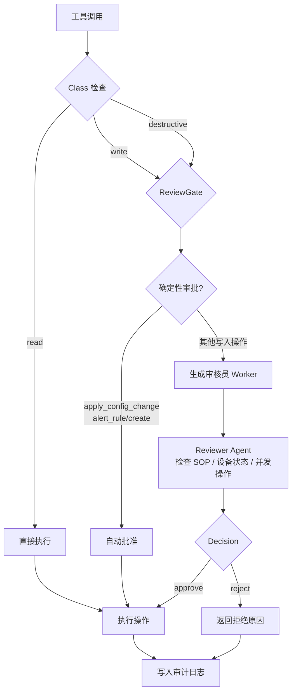

---

## 5. 对话式告警配置

### 5.1 功能概述

用户通过自然语言描述告警需求，AI 自动完成：意图理解 → 指标发现 → PromQL 编译 → 草案验证 → 用户确认 → 应用。

### 5.2 完整流程

```mermaid
flowchart TD
    A["用户: MySQL 连接数超过 80% 告警"] --> B[协调员识别为告警规则创建]
    B --> C[调用 list_metric_catalog<br/>query='MySQL connection usage']
    
    C --> D{catalog 有可用指标?}
    D -->|是| E[调用 draft_config_change<br/>domain=alert_rule<br/>action=create<br/>rule={...}]
    D -->|否| F[告知用户指标缺失<br/>停止流程]
    
    E --> G{编译和验证}
    
    subgraph "AlertDraft 编译管线"
        G --> G1[normalizeAlertRuleConfigInput<br/>推断 kind/scope/severity]
        G1 --> G2[normalizeMetricRawSpec<br/>组装 PromQL]
        G2 --> G3[mergeSelectorIntoPromQL<br/>合并标签选择器]
        G3 --> G4[stripLeakedMetricSourceIdentityMatchers<br/>清理泄漏的源标识]
        G4 --> G5[validateMetricRawDraft<br/>验证 PromQL 语义]
        G5 --> G6[validatePreviewContract<br/>验证预览数据契约]
    end
    
    G6 --> H{验证结果}
    H -->|config_validation_failed| I[返回 validation.issues]
    I --> J[AI 按 issues 修复 rule]
    J --> E
    
    H -->|config_draft| K[返回 draft_hash<br/>停止工具调用<br/>等待用户确认]
    K --> L{用户确认?}
    L -->|确认| M[调用 apply_config_change<br/>confirmed=true<br/>draft_hash=xxx<br/>payload=原始draft]
    L -->|取消| N[丢弃草案]
    
    M --> O[二次验证 draft_hash 完整性]
    O --> P[CreateRule on Alert Service]
    P --> Q[返回创建结果]
```

### 5.3 告警类型支持

| 告警类型 (Kind) | 说明 | PromQL 要求 |
|-----------------|------|------------|
| `metric_threshold` | 指标阈值告警 | 布尔谓词 (comparison) |
| `metric_absence` | 指标缺失告警 | 无需 PromQL |
| `metric_forecast` | 指标预测告警 | 布尔谓词 |
| `metric_raw` | 原始 PromQL 告警 | 用户提供的完整表达式 |
| `log_match` | 日志匹配告警 | 不需要 PromQL |
| `log_absence` | 日志缺失告警 | 不需要 PromQL |
| `trace_match` | 链路匹配告警 | 不需要 PromQL |

### 5.4 自然语言编译能力

`alertdraft` 包实现了完整的 NL → PromQL 编译：

| 功能 | 实现 |
|------|------|
| 友好指标名转换 | `cpu_pct` → `100*(1-avg(rate(node_cpu_seconds_total{mode="idle"}[5m])))` |
| 主机/全局范围推断 | 中文/英文关键词匹配 (`HostScopeRecommended`) |
| 数据库范围检测 | 检测 MySQL/PostgreSQL/Redis/MongoDB 关键词 |
| PromQL 注入防护 | 清理泄漏的 `ongrid_source`/`device_id` 标签 |
| 窗口/持续时间分发 | `window`/`for` 参数分发到正确的 kind 字段 |
| 反直觉指标转换 | `disk_available_pct` → `disk_used_pct` 逆指标 |

---

## 6. 事件自动调查

### 6.1 功能概述

当告警触发时，系统**自动启动 AI 调查**，异步分析根因，生成结构化调查报告，无需人工干预。

### 6.2 触发与执行流程

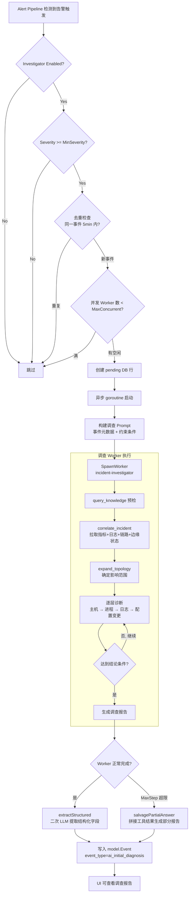

### 6.3 结构化调查报告

调查完成后，从 Worker 的叙事性回答中提取以下结构化字段：

| 字段 | 说明 |
|------|------|
| `root_cause` | 根本原因描述 |
| `affected_window` | 影响时间窗口 |
| `pinpointed_target` | 定位到的具体目标(主机/服务/组件) |
| `related_alerts` | 关联告警列表 |
| `evidence` | 证据链(指标截图/日志片段) |
| `suggested_actions` | 建议操作 |
| `confidence` | 置信度评分 (low/medium/high) |

### 6.4 配置参数

| 参数 | 默认值 | 说明 |
|------|--------|------|
| `Enabled` | true | 是否启用自动调查 |
| `MinSeverity` | warning | 最低触发级别 |
| `DedupWindow` | 5min | 去重窗口 |
| `MaxConcurrent` | 5 | 最大并发调查数 |
| `WorkerTimeout` | 20min | 单个调查超时 |
| `AgentName` | incident-investigator | 使用的 Agent Persona |

---

## 7. 知识库与 RAG

### 7.1 架构

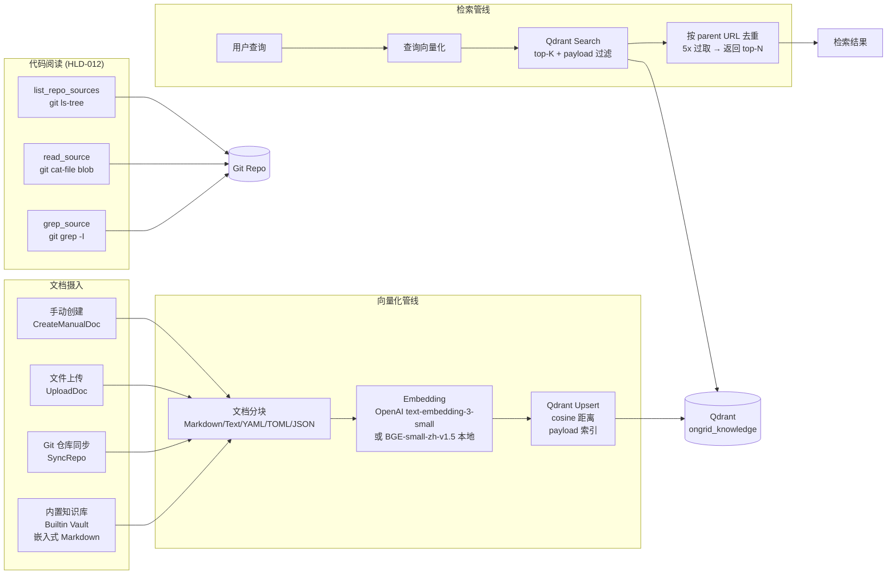

### 7.2 RAG-first 策略

协调员在处理运维/排查类问题时，**必须先查知识库再决定下一步**：

1. 用户问题 → `query_knowledge(query=用户原句)`
2. 如果 top score ≥ 0.6 → 基于 Playbook 步骤回答，标注来源 `(参考 KB: <title>)`
3. 如果未命中 → 走通用诊断流程
4. 同一会话同一主题只查一次

### 7.3 内置知识库

平台内置知识库 (Builtin Vault) 包含团队精选的中文运维 Playbook：

- DNS 故障排查
- Conntrack 表满处理
- MTU 问题诊断
- eBPF 程序调试
- TLS 证书问题
- netshoot 容器诊断
- Network Namespace 操作

内置知识库通过 Go `embed.FS` 嵌入二进制文件，**无需网络依赖**，适合离线/中国内地部署。

---

## 8. 技能系统

### 8.1 技能架构

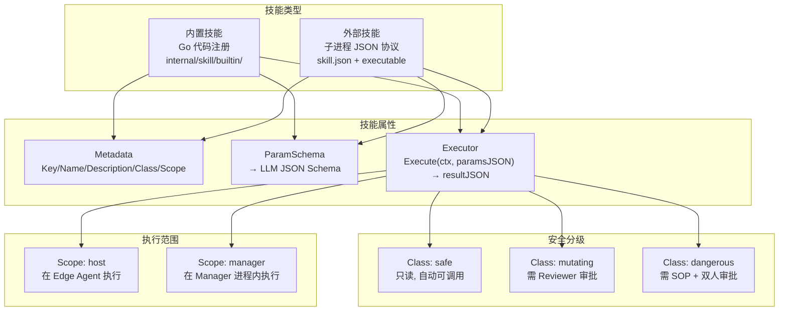

### 8.2 内置技能清单

| 技能 | Key | Class | Scope | 描述 |
|------|-----|-------|-------|------|
| TCP 探测 | `host_probe_tcp` | safe | host | TCP 连通性+延迟探测 |
| HTTP 探测 | `host_probe_http` | safe | host | HTTP 状态码+延迟+大小 |
| DNS 探测 | `host_probe_dns` | safe | host | DNS 解析探测 |
| 数据库探测 | `host_probe_database` | safe | host | 数据库连通性探测 |
| DB 查询 | `db_exec_query` | safe | host | 只读 SQL(SELECT/SHOW/EXPLAIN) |
| Journal 读取 | `host_read_journal` | safe | host | Systemd Journal 读取 |
| 文件尾部 | `host_tail_file` | safe | host | 文件尾部读取 |
| 网络命名空间 | `host_netns_inspect` | safe | host | Netns 检查 |
| Web 搜索 | `web_search` | safe | manager | 多供应商 Web 搜索 |
| 服务重启 | `host_restart_service` | mutating | host | Systemd 服务重启(需审核) |

### 8.3 技能激活机制

技能通过 `SKILL.md` 文件的 `activation` 字段定义激活方式：

- **`mode: always`** — 始终激活，工具始终在 Tool Bag 中
- **`mode: keyword`** — 关键词匹配激活，用户消息包含指定关键词时挂载

示例 (`skills/host-files/SKILL.md`)：
```yaml
activation:
  mode: keyword
  keywords: ["file", "disk", "size", "大文件", "磁盘", "目录", "空间"]
```

---

## 9. LLM 基础设施

### 9.1 多供应商路由

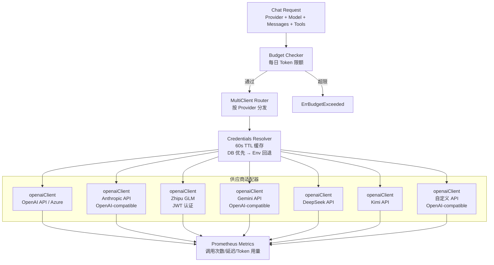

### 9.2 支持的供应商与模型

| 供应商 | 默认模型 | 配置前缀 | 认证方式 |
|--------|---------|---------|---------|
| OpenAI | gpt-5.4 | `ONGRID_OPENAI_` | API Key Bearer |
| Anthropic | claude-sonnet-4-6 | `ONGRID_ANTHROPIC_` | API Key Bearer |
| Zhipu | glm-4.7 | `ONGRID_ZHIPU_` | JWT (HS256) |
| Gemini | gemini-2.5-pro | `ONGRID_GEMINI_` | API Key Bearer |
| DeepSeek | deepseek-v4-flash | `ONGRID_DEEPSEEK_` | API Key Bearer |
| Kimi | kimi-k2.6 | `ONGRID_KIMI_` | API Key Bearer |
| 自定义 | (用户配置) | `ONGRID_CUSTOM_` | API Key Bearer |

**动态模型切换：** 用户可在 Web UI 中按消息切换供应商/模型，无需重启服务。凭证也可以在 DB (`system_settings`) 中配置，通过 `Credentials Resolver` 动态生效。

### 9.3 成本控制

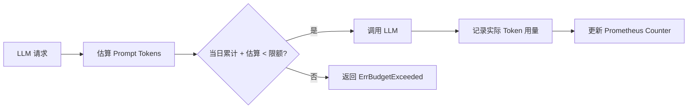

- **每日 Token 限额** (`ONGRID_LLM_DAILY_TOKEN_LIMIT`)，基于 UTC 日重置
- 请求前**预估** prompt tokens，防止超限调用
- 完成后**记录**实际 usage，精确追踪
- 同时在 **legacy agent kernel** 和 **eino graph kernel** 两个路径生效

### 9.4 Embedding 向量化

支持两种 Embedding 后端：

| 后端 | 模型 | 维度 | 适用场景 |
|------|------|------|---------|
| OpenAI API | text-embedding-3-small | 1536 | 有网络访问、高质量需求 |
| ONNX Local | BGE-small-zh-v1.5 | 512 | 离线/中国内地、中文优化 |

---

## 10. 边缘智能体

### 10.1 架构

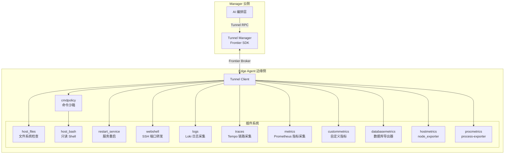

### 10.2 命令沙箱 (cmdpolicy)

`host_bash` 技能通过 `cmdpolicy` 包在执行前进行**白名单+黑名单**双重检查：

**允许的命令类别：**
- 进程检查：`ps`, `pgrep`, `pidof`, `top`, `htop`
- 文本处理：`grep`, `awk`, `sed`, `sort`, `uniq`, `wc`, `tr`, `cut`
- 文件浏览：`ls`, `find`, `du`, `stat`, `file`, `cat`, `head`, `tail`
- 系统日志：`dmesg`, `journalctl`
- 网络工具：`ss`, `netstat`, `iptables`, `ip`, `ovs-*`, `nft`, `conntrack`, `bpftool`
- 系统管理：`systemctl status`, `sysctl`, `df`, `mount`, `free`
- 网络诊断：`curl`, `dig`, `nslookup`, `ping`, `traceroute`, `nc`

**禁止的操作：**
- 文件写入/删除：`rm`, `mv`, `cp`, `dd`, `sed -i`, `find -delete`
- 系统修改：`systemctl restart/stop/start`, `kill`, `pkill`
- 重定向和管道写入：`>`, `>>`, `tee`
- Shell 嵌套：`$(...)`, `` `...` ``, `eval`, `exec`

---

## 11. 前端交互

### 11.1 AI 交互界面

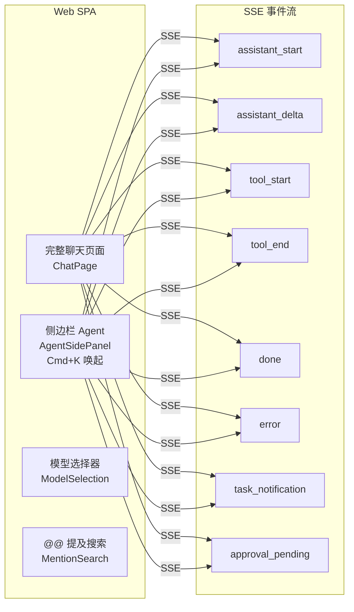

### 11.2 核心交互流程

| 功能 | 入口 | 交互方式 |
|------|------|---------|
| AI 聊天 | 侧边栏/聊天页面 | Markdown 渲染 + 工具调用卡片 + 流式输出 |
| 模型选择 | 聊天输入框上方 | 按供应商/模型下拉选择，每消息可切换 |
| @提及 | 输入 `@` | 搜索设备/事件/规则，选中后注上下文 |
| NL 查询翻译 | PromQL/LogQL 编辑器 | "AI 生成" 按钮 → `/v1/aiops/query-translate` |
| 人工审批 | 聊天消息内 | 云命令/技能安装的内联确认卡片 |
| 会话管理 | 侧边栏会话列表 | 新建/重命名/删除/切换会话 |
| Agent 管理 | 设置页面 | 创建/编辑/删除自定义 Agent Persona |

---

## 12. 可观测性与审计

### 12.1 AI 子系统指标

所有指标通过 Prometheus 暴露在 `/metrics` 端点：

| 指标名 | 类型 | 标签 | 说明 |
|--------|------|------|------|
| `ongrid_tool_invocations_total` | Counter | name, result | 工具调用总数 |
| `ongrid_tool_duration_seconds` | Histogram | name | 工具执行耗时 |
| `ongrid_graph_iterations_total` | Counter | result | 图引擎迭代次数 |
| `ongrid_graph_chat_turns_total` | Counter | result | LLM 对话轮次 |
| `ongrid_llm_requests_total` | Counter | provider, model, status | LLM API 请求 |
| `ongrid_llm_tokens_total` | Counter | provider, model, type | Token 消耗 |
| `ongrid_llm_request_duration_seconds` | Histogram | provider, model | LLM 响应延迟 |

### 12.2 审计日志

每次工具调用、LLM 对话、Agent 分派都会写入结构化审计日志 (slog INFO)：

```json
{
  "event": "tool_call",
  "tool": "host_bash",
  "class": "read",
  "device_id": "3",
  "user_id": "admin",
  "tenant_id": "org-1",
  "args_bytes": 245,
  "duration_ms": 1234,
  "status": "success"
}
```

### 12.3 调用链追踪

所有 AI 操作关联以下标识符，支持端到端追踪：

| 标识符 | 说明 |
|--------|------|
| `session_id` | 会话 ID (用户 → Coordinator) |
| `worker_session_id` | Worker 会话 ID (Coordinator → Specialist) |
| `llm_call_id` | LLM API 调用 ID (用于 tool_replay 重建) |
| `tool_call_id` | 工具调用 ID (对应 chat_tool_calls 行) |
| `draft_hash` | 配置草案哈希 (告警创建的完整性保护) |

---

## 附录 A: 关键文件索引

| 子系统 | 关键文件 |
|--------|---------|
| 入口/协调员 | `cmd/ongrid/main.go` |
| Chat Runtime | `internal/manager/biz/aiops/chatruntime/runtime.go` |
| Worker 管理 | `internal/manager/biz/aiops/chatruntime/worker.go` |
| System Prompt | `internal/manager/biz/aiops/chatruntime/system_prompt.go` |
| ReAct Graph | `internal/manager/biz/aiops/graph/react.go` |
| 工具适配器 | `internal/manager/biz/aiops/graph/tool_adapter.go` |
| 工具注册 | `internal/manager/biz/aiops/tools/registry.go` |
| BaseTool | `internal/manager/biz/aiops/tools/registry_basetool.go` |
| AgentTool | `internal/manager/biz/aiops/tools/agent_tool.go` |
| 配置工具 | `internal/manager/biz/aiops/tools/config_tools.go` |
| 告警编译 | `internal/manager/biz/aiops/alertdraft/compiler.go` |
| 告警配置管理 | `internal/manager/biz/aiops/alertconfig/alert_rule_manager.go` |
| 事件调查 | `internal/manager/biz/aiops/investigator/investigator.go` |
| 告警调查 | `internal/manager/biz/alert/investigator/usecase.go` |
| 装饰器链 | `internal/manager/biz/aiops/tools/decorators/chain.go` |
| 审核门 | `internal/manager/biz/aiops/tools/decorators/review_gate.go` |
| LLM 客户端 | `internal/pkg/llm/client.go` |
| LLM 路由 | `internal/pkg/llm/router.go` |
| 向量嵌入 | `internal/pkg/embedding/embedding.go` |
| Qdrant 客户端 | `internal/pkg/qdrantx/client.go` |
| 知识库 | `internal/manager/biz/knowledge/usecase.go` |
| 技能系统 | `internal/skill/registry.go` |
| 命令沙箱 | `internal/edgeagent/cmdpolicy/` |
| Agent Personas | `agents/*.md` |
| 技能定义 | `skills/*/SKILL.md` |
| 测试守卫 | `cmd/ongrid/coordinator_tools_test.go` |

---

## 附录 B: 配置环境变量

| 变量 | 默认值 | 说明 |
|------|--------|------|
| `ONGRID_AGENT_KERNEL` | legacy | `graph` 启用 eino 图引擎 |
| `ONGRID_LLM_DEFAULT_PROVIDER` | openai | 默认 LLM 供应商 |
| `ONGRID_LLM_DAILY_TOKEN_LIMIT` | 0 (无限) | 每日 Token 限额 |
| `ONGRID_OPENAI_API_KEY` | - | OpenAI API Key |
| `ONGRID_OPENAI_BASE_URL` | https://api.openai.com/v1 | OpenAI Base URL |
| `ONGRID_OPENAI_MODEL` | gpt-5.4 | OpenAI 模型 |
| `ONGRID_ANTHROPIC_API_KEY` | - | Anthropic API Key |
| `ONGRID_ANTHROPIC_BASE_URL` | https://api.anthropic.com/v1 | Anthropic Base URL |
| `ONGRID_ANTHROPIC_MODEL` | claude-sonnet-4-6 | Anthropic 模型 |
| `ONGRID_ZHIPU_API_KEY` | - | Zhipu API Key |
| `ONGRID_ZHIPU_MODEL` | glm-4.7 | Zhipu 模型 |
| `ONGRID_DEEPSEEK_API_KEY` | - | DeepSeek API Key |
| `ONGRID_DEEPSEEK_MODEL` | deepseek-v4-flash | DeepSeek 模型 |
| `ONGRID_EMBEDDING_PROVIDER` | openai | Embedding 供应商 |
| `ONGRID_EMBEDDING_MODEL` | text-embedding-3-small | Embedding 模型 |
| `ONGRID_EMBEDDING_DIM` | 1536 | 向量维度 |
| `ONGRID_TOOLBAG_DEFERRAL_THRESHOLD` | 30 | 工具延迟注册阈值 |
| `ONGRID_SKILLS_EXTERNAL_DIRS` | - | 外部技能目录 |

---

> 文档版本: v0.9.0  
> 生成日期: 2026-06-29  
> 对应代码分支: main (commit `03e8f37`)
